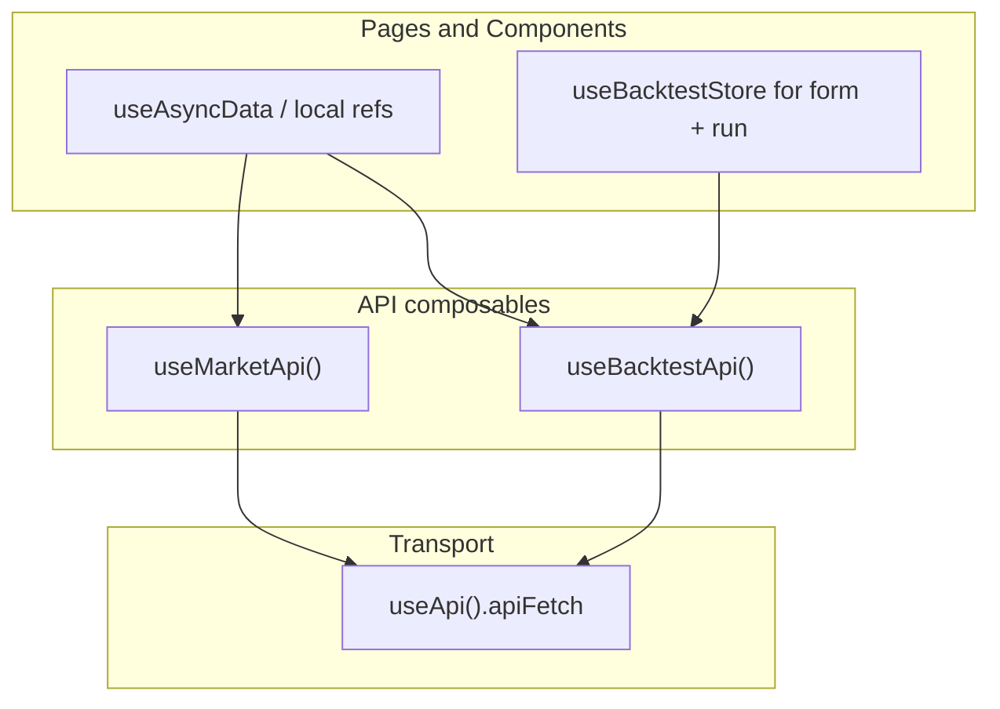

# State and Data Fetching (SSR Nuxt)

How this frontend chooses between `useAsyncData`, API composables, Pinia, and local refs.

## Layers

| Layer | Responsibility | Example |
|-------|----------------|---------|
| `useApi()` | HTTP transport, SSR `baseURL`, error parsing | `apiFetch`, `errorMessage` |
| `useMarketApi()` / `useBacktestApi()` | Typed endpoint functions, **no state** | `getSummary`, `listRuns` |
| Pinia stores | Mutable, interactive, cross-route state | backtest `form`, `lastReport` |
| `useAsyncData` | SSR-safe page reads, keyed cache, `pending`/`error` | watchlist, ticker detail |
| Local `ref` / composables | Ephemeral or browser-only state | search results, `useWatchlist` |



## How SSR data flows

1. On the server, `useAsyncData` runs its fetcher and stores the result in `nuxtApp.payload.data` under a unique key.
2. That payload is sent to the client and hydrates so the first paint matches SSR (no double-fetch for the same key).
3. On client navigations, Nuxt may reuse the cached payload for that key and **skip** the fetcher.
4. Pinia state also serializes per SSR request via `@pinia/nuxt`. Client-side, Pinia is a session singleton — SPA navigations do **not** reset stores.

`useAsyncData` and Pinia are different caches. Prefer one reader for a given piece of data.

## Decision table

| Need | Use | Not |
|------|-----|-----|
| Page/route read data (SEO or first paint) | `useAsyncData` + API composable | Pinia as primary read cache |
| Typed API URLs shared across pages | `useMarketApi` / `useBacktestApi` | Raw `apiFetch` in components |
| Multi-step form surviving route changes | Pinia (`useBacktestStore().form`) | Page-local refs if never shared |
| Result of a user write action on the same page | Pinia (`lastReport` after `runBacktest`) | `useAsyncData` (no natural cache key) |
| Browser-only persistence | Composable (`useWatchlist`) | Pinia (unless shared widely) |
| Ephemeral UI (debounced search) | Component-local `ref` + API composable | Pinia |
| Cross-page entity cache with many keys | Keyed Pinia map **or** `useAsyncData` keys | Single-slot store refs |

## When Pinia is a good fit

- Mutable application state that should survive route changes within a session (forms, wizards).
- Actions that **write** then update UI (POST backtest → show report on the same page).
- State consumed by unrelated components without prop drilling.
- Simple global UI flags (sidebar, theme) — `useState` also works for lighter cases.

## When Pinia is a poor fit

- Read-only GET data owned by a single page/route.
- Parameterized route data (`/market/:ticker`) unless you invest in **keyed** store maps.
- Anything `useAsyncData` already provides: `pending`, `error`, keyed cache, SSR payload.

## Anti-patterns (avoided here)

### Dual source of truth

Do not store the same entity in both Pinia and `useAsyncData.data` and read from both. Pick one:

- **Page reads** → `useAsyncData.data` (canonical for this app).
- **Interactive write results** → Pinia (`lastReport`).

### Single-slot store + multi-key `useAsyncData`

Pinia **does** keep `summaryItems` across SPA back navigation. That is fine for a single watchlist slot.

Parameterized routes are different: one `tickerInfo` ref + cache keys per symbol means AAPL → MSFT → Back can leave the store on MSFT while `useAsyncData` still has AAPL cached. Either use keyed maps or read from `useAsyncData.data` (we do the latter).

### Shared `pending` / `error` across unrelated fetches

One store-wide `pending` flag races when two fetches run in parallel (ticker info + OHLCV). Prefer `useAsyncData`'s per-call `pending`/`error`, or per-resource flags if you must use a store.

## Conventions in this codebase

| Surface | Pattern |
|---------|---------|
| `pages/index.vue` | `useAsyncData` + `useMarketApi().getSummary` |
| `pages/market/[ticker].vue` | `useAsyncData` + `getTicker` / `getOhlcv` |
| `components/market/WatchlistAddTicker.vue` | Local refs + `searchTickers` (abort/debounce) |
| `pages/backtest/history.vue` | `useAsyncData` + `listRuns` |
| `pages/backtest/[id].vue` | `useAsyncData` + `getRun` |
| `pages/backtest/index.vue` | Pinia form + `runBacktest` → `lastReport` |
| `composables/useWatchlist.ts` | `localStorage`, not Pinia |

Canonical page read:

```ts
import { useMarketApi } from '~/composables/useMarketApi'

const { getSummary } = useMarketApi()
const symbolsParam = computed(() => /* ... */)

const { data, pending, error, refresh } = await useAsyncData(
  'market-summary',
  () => getSummary(symbolsParam.value || undefined),
  { watch: [symbolsParam] },
)
```

Canonical interactive write:

```ts
const store = useBacktestStore()
await store.runBacktest()
// template: store.lastReport, store.pending, store.error
```

Do not call `apiFetch` from pages or components — go through `useMarketApi` / `useBacktestApi`.

## When to reconsider Pinia for reads

Only if you need **cross-page instant reuse** (e.g. prefetch ticker on watchlist → open detail without waiting) and are willing to add keyed caches plus a clear single source of truth. Otherwise `useAsyncData` per route stays simpler.
